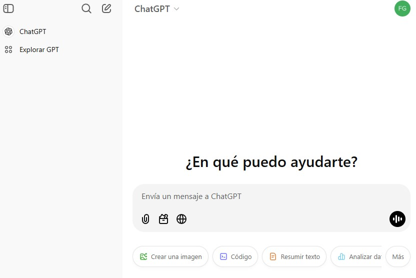

## Modelos

1. Claude de Anthropic: https://claude.ai [modelo estático, mejor para programación]
2. ChatGPT de OpenAI: https://chatgpt.com/ [busqueda web, creación de imágenes]
3. Mistral de Mistral.ai: https://chat.mistral.ai [busqueda web]
3. Perplexity: https://perplexity.ai [busqueda web]
3. Gemini de Google: https://gemini.google.com/?hl=es-ES [busqueda web, creación de imágenes]
4. Microsoft Bing: https://www.bing.com/images/create [creación de imágenes, basado el Dall-E]

----

### Estructura de una página

La estructura de la página de las herramienta conversacionales es idéntica, normalmente se divide la página en dos partes: 
  - Izquierda: lista de conversaciones
  - Derecha: Introducción de texto o de imágenes (el modelo es multimodal). 

En algunos casos se puede acceder a busquedas web o a modelos personalizados

----

### Estructura de una página: chat conversacional

----- 

### Estructura de una página: creación de imágenes

El modelo acepta una entrada de texto a partir de la que muestra un conjunto de imágenes creadas a partir del texto. En este caso, como la herramienta no modifica la imagen sino que crea una nueva a partir de las indicaciones, se trata de ir modificando el prompt para acercarnos al resultado deseado.

-----

### Indicaciones y contexto

Cada **conversación** se inicia con la introducción de instrucciones al modelo. Las instrucciones se realizan utilizando texto (prompt, indicaciones), voz y documentos. El modelo encadena las respuestas anteriores (contexto) y la indicación actual como información para escribir la siguiente respuesta

----

 Para imágenes mas desenfadadas recomiendo utilizar el termino de "arte digital"

----

