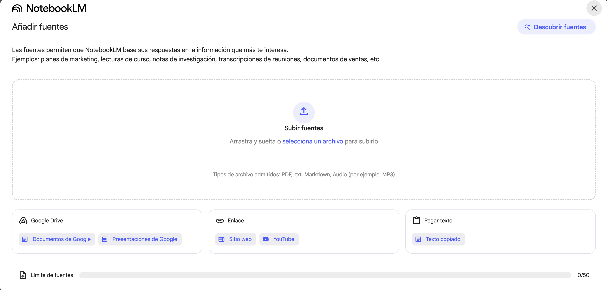
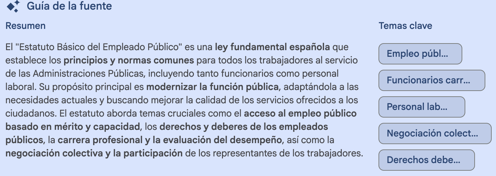

## Contexto

- La IA generativa destaca en la generación de contenidos, pero presenta limitaciones en la respuesta a preguntas
- Limitaciones principales:
    - Tendencia a generar información ficticia (alucinaciones)
    - Sesgo de confirmación (tendencia a dar la razón)

---
## Solución propuesta

- **Chats inteligentes que responden usando *solo* tu documentación verificada.**
- Herramientas disponibles: ChatGPT (versión de pago) y Google NotebookML

---
## Google NotebookML: ¿Qué es?

- **Chat especializado:** Interactúa con tus propios documentos y fuentes.
- **Basado en fuentes:** Las respuestas se generan *exclusivamente* a partir de la información que proporcionas.
- **Evita alucinaciones:** Al limitarse a las fuentes, reduce drásticamente la invención de datos.
- **Cita fuentes:** Indica qué documento o sección respalda cada parte de la respuesta.
- **Gratuito:** Accesible con una cuenta de Google.

---
## Google NotebookML: Tipos de Fuentes Soportadas

- **Documentos:**
    - PDFs
    - Google Docs
    - Archivos de texto (.txt)
    - Markdown (.md)
- **Contenido Web:**
    - URLs de páginas web
    - Vídeos de YouTube (transcripciones) y audios
- **Notas Manuales:**
    - Texto copiado y pegado directamente
    - Notas creadas dentro del propio NotebookML

---
## Google NotebookML: Beneficios Clave

- **Fiabilidad:** Respuestas basadas en información verificada y con referencias.
- **Personalización:** Se adapta al conocimiento específico de tu equipo o área (normativa, procedimientos internos).
- **Eficiencia:** Resuelve dudas frecuentes rápidamente, liberando tiempo del personal.
- **Consistencia:** Asegura que las respuestas sean uniformes y basadas en la documentación oficial.
- **Democratización del conocimiento:** Facilita el acceso a información compleja para todos.
- **Incorporación:** Ideal para que el nuevo personal se ponga al día rápidamente.

---
## Flujo de trabajo: 1. Creación del Notebook

---
## Flujo de trabajo: 1. Creación del Notebook

Iniciar un nuevo notebook para un tema o proyecto específico (ej. "Normativa PTGAS UPO").

---

## Flujo de trabajo: 2. Incorporación de Fuentes

---

## Flujo de trabajo: 2. Incorporación de Fuentes

- **Añadir contenido:** Utilizar las opciones de la interfaz o arrastrar archivos directamente.
- **Opciones:**
    - **Subir archivo:** Cargar PDFs, .txt, Markdown y archivos de Audio (ej. MP3) desde tu ordenador.
    - **Google Drive:** Seleccionar Documentos y Presentaciones directamente desde tu Drive. (Se sincronizan si se modifican).
    - **Enlace:** Pegar URLs de Sitios web o vídeos de YouTube.
    - **Pegar texto:** Introducir texto copiado directamente como una nota-fuente.
- **Selección:** Elegir las fuentes más relevantes y actualizadas para el tema del notebook.
- **Límite:** Hasta 50 fuentes por notebook (cada fuente hasta 500.000 palabras aprox.).

---

## Flujo de trabajo: 3. Realización de Consultas

---

## Flujo de trabajo: 3. Realización de Consultas

- **Interactuar con el chat:** Escribir preguntas en lenguaje natural en el cuadro de texto inferior.
- **Usar sugerencias:** NotebookML propone preguntas iniciales basadas en las fuentes cargadas. Haz clic en ellas para empezar.
- **Refinar preguntas:** Si la respuesta no es la esperada, reformula la pregunta o sé más específico.
- **Verificar fuentes:** Comprobar las citas numéricas [1], [2]... que aparecen en la respuesta para ver qué documento o sección la respalda. Haz clic en el número para ir a la fuente.
- **Explorar:** Realizar diversas preguntas para entender cómo interpreta la IA la información y qué tipo de respuestas puede generar.

---
## Flujo de trabajo: 4. Guardar notas clave

---

## Flujo de trabajo: 4. Guardar notas clave

- **Identificar información relevante:** Durante la interacción con el chat, selecciona las respuestas o fragmentos más útiles.
- **Utilizar el botón "Guardar como nota":** Este botón aparece junto a las respuestas del chat o al seleccionar texto dentro de una fuente.
- **Organización:** Las notas se guardan en el panel "Studio" y pueden ser consultadas, editadas o eliminadas posteriormente.
- **Base de conocimiento:** Las notas guardadas enriquecen la base de conocimiento del notebook, actuando como fuentes adicionales para futuras consultas y generaciones de contenido.

---

## Flujo de trabajo: 5. Añadir Contexto Manualmente

---

## Flujo de trabajo: 5. Añadir Contexto Manualmente

- **Crear nueva nota:** En el panel "Studio", utiliza la opción "+ Añadir nota".
- **Propósito:**
    - Incorporar información que no está en las fuentes (ej. decisiones internas recientes, aclaraciones específicas de un servicio).
    - Resumir conceptos complejos o procedimientos con tus propias palabras para mayor claridad.
    - Incluir enlaces a recursos externos o referencias adicionales relevantes.
- **Integración:** Estas notas manuales se tratan como fuentes adicionales para el chat y las herramientas del Studio, permitiendo respuestas más completas y contextualizadas.

---

## Flujo de trabajo: 6. Generación de Contenido con Studio

- **Acceder a Herramientas:** En el panel "Studio", se encuentran diversas opciones para generar contenido automáticamente basado en las fuentes y notas.
- **Tipos de contenido:** Resúmenes, FAQs, Guías de estudio, Cronologías, Mapas conceptuales, etc.
- **Personalización:** Permite refinar las generaciones indicando el enfoque o los temas a tratar.
- **Utilidad:** Acelera la creación de documentación, material formativo o respuestas estandarizadas.

---
## Flujo de trabajo: 7. Resolución Continua de Dudas

- **Chat como herramienta principal:** Utilizar la ventana de chat para consultas recurrentes del personal o alumnado.
- **Base de conocimiento consolidada:** El chat aprovecha todas las fuentes (documentos, webs, notas guardadas, notas manuales) para dar respuestas consistentes y basadas en la información erificada.
- **Rapidez y eficiencia:** Reduce el tiempo dedicado a responder preguntas repetitivas.
- **Citación de fuentes:** Cada respuesta incluye referencias a las fuentes específicas utilizadas, garantizando la trazabilidad y fiabilidad.

---
## Flujo de trabajo: 8. Mantenimiento del Notebook

- **Actualización de fuentes:** Reemplazar o añadir nuevos documentos cuando la normativa o los procedimientos cambien. Sincronizar Google Docs/Slides si se han modificado.
- **Revisión de notas:** Asegurarse de que las notas guardadas y las manuales siguen siendo precisas y relevantes.
- **Eliminación de obsoletos:** Retirar fuentes o notas que ya no estén vigentes.
- **Periodicidad:** Establecer una rutina (ej. trimestral, anual o tras cambios normativos importantes) para revisar y mantener actualizado el contenido del notebook.

---
## Interfaz de Google NotebookML: Visión General

---
## Interfaz de Google NotebookML: Visión General

- **Panel Izquierdo (Fuentes):** Gestiona los documentos base. Muestra resúmenes y temas clave al seleccionar una fuente.
- **Panel Central (Chat):** Área principal para hacer preguntas y recibir respuestas. Incluye sugerencias de preguntas.
- **Panel Derecho (Studio):** Almacena notas guardadas y contiene herramientas para generar contenido adicional.

---
## Interfaz: Panel de Fuentes (Detalle)

---
## Interfaz: Panel de Fuentes (Detalle)

- **Iconos:** Indican el tipo de fuente (PDF, Web, Doc, Nota).
- **Gestión:** Permite añadir, eliminar o seleccionar/deseleccionar fuentes para acotar la base de conocimiento de una consulta específica.

---
## Interfaz: Panel de Fuentes (Detalle)

- **Resumen rápido:** Al hacer clic en una fuente, se muestra un resumen generado por IA y los temas clave detectados.

---
## Interfaz: Panel Studio (Herramientas)

---

## Interfaz: Panel Studio (Herramientas)

- **Notas:** Acceso a todas las notas guardadas desde el chat o creadas manualmente.
- **Herramientas Creativas:**
    - **Resumen:** Síntesis del contenido.
    - **Preguntas Frecuentes (FAQ):** Genera Q&A probables.
    - **Guía de estudio:** Material estructurado para aprendizaje.
    - **Cronología:** Ordena eventos temporalmente.
    - **Mapa conceptual:** (Experimental) Visualiza relaciones entre ideas.
    - **Resumen de audio:** (Experimental) Conversación simulada (inglés).

---
## Aplicación Práctica en el PTGAS UPO

### Áreas de Implementación Potenciales
- **Atención al Usuario:** Respuestas inmediatas a consultas habituales del personal y estudiantes sobre normativa, plazos, etc.
- **Asistencia en Procedimientos:** Guía paso a paso para trámites (solicitud de permisos, evaluación desempeño).
- **Interpretación de Normativa:** Explicación clara de regulaciones y su aplicación práctica.
- **Formación y Onboarding:** Recurso de consulta centralizado para nuevos miembros y para refrescar conocimientos.

---
## Caso Práctico: Notebook "Normativa PTGAS UPO"

### Fuentes Utilizadas
- **Normativa General y Estatutaria:** EBEP, Ley de Incompatibilidades.
- **Carrera, Desempeño y Formación:** Reglamentos UPO de Evaluación, Carrera Horizontal y Formación PAS.
- **Contratación y Provisión:** Acuerdos sobre Provisión de Puestos, Promoción Interna, Bolsas de Trabajo PAS Funcionario.
- **Conciliación y Permisos:** Acuerdo Jornadas/Vacaciones/Permisos, Medidas de Conciliación.
- **Protocolos:** Protocolo Acoso Sexual/Razón de Sexo.
- **Webs UPO:** FAQs RRHH, Incidencias eTempo, Asuntos Propios.

---

### Documentos para el notebook 

- Descarga de los documentos pdf de google drive: https://drive.google.com/drive/folders/1MVZanSWFgSjkfmOoFlWloVSq8-QvES5S?usp=sharing y añadelos como fuentes

---
## Ejemplos de Consultas al Notebook PTGAS

- *Si me incorporo como funcionario a la UPO desde otra administración, ¿cómo se computan mis trienios y servicios previos según el EBEP y la normativa UPO?*
- *¿Cuántos días de asuntos propios corresponden a un funcionario este año según el acuerdo de jornadas?*
- *Explícame las principales diferencias en las medidas de conciliación entre el EBEP y el acuerdo específico de la UPO.*
- *¿Cuál es la duración de la jornada semanal ordinaria para el PTGAS funcionario en la UPO?*
- *Tengo 30 años de antigüedad como funcionario, ¿cuántos días adicionales de vacaciones y asuntos propios me corresponden según la normativa vigente en la UPO?*
- *Si creo que estoy sufriendo acoso laboral, ¿qué pasos debo seguir según el protocolo de la UPO?*
- *Resume los puntos clave del Reglamento de Evaluación del Desempeño del PTGAS.*

---
## Conclusiones

- Google NotebookML es una herramienta **potente y gratuita** para crear asistentes de chat basados en **información propia y verificada**.
- **Reduce alucinaciones** y aumenta la **fiabilidad** de las respuestas.
- Ideal para gestionar conocimiento interno (normativa, procedimientos) y externo (atención a usuarios).
- Facilita la **eficiencia**, la **consistencia** y el **acceso a la información** en la gestión administrativa.

---
## Preguntas